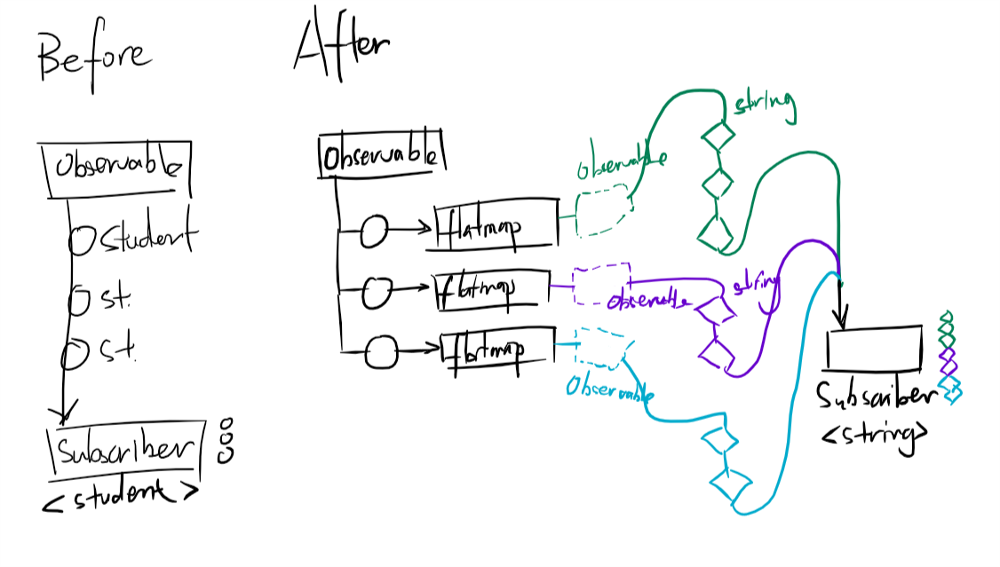
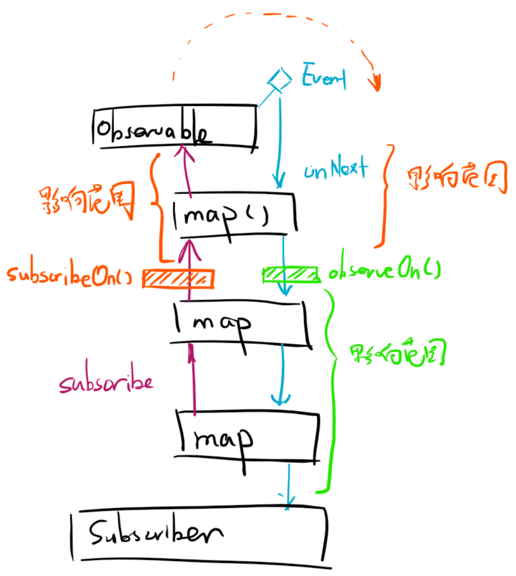
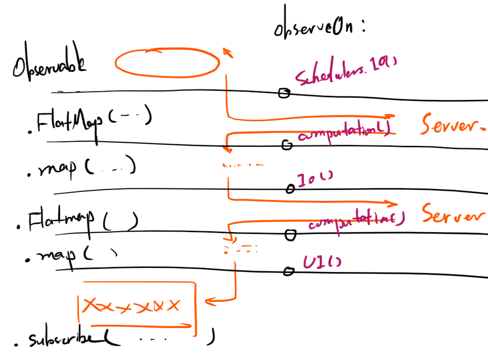
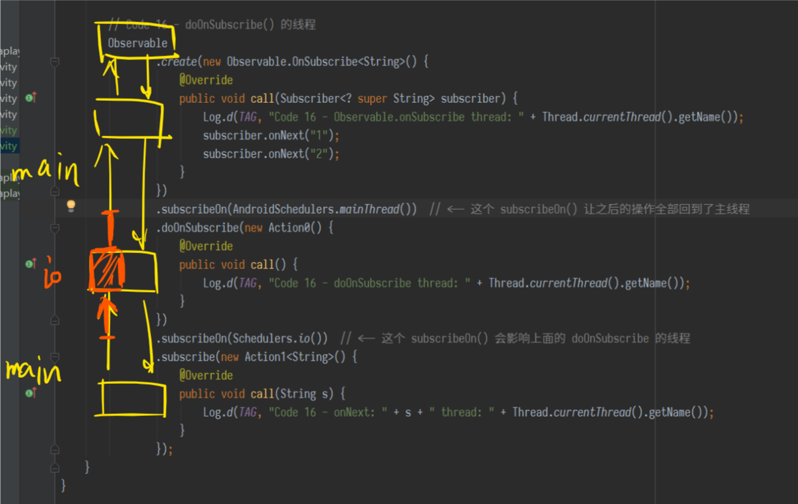
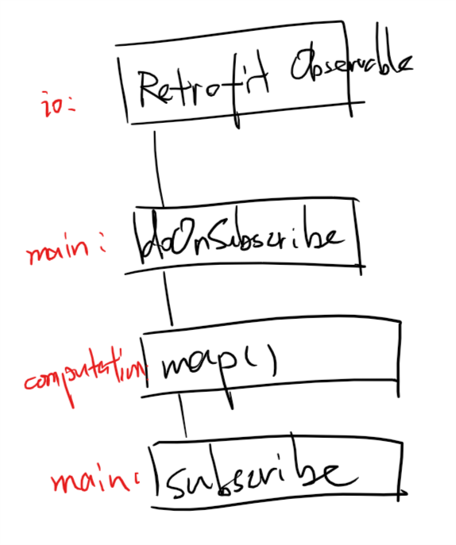
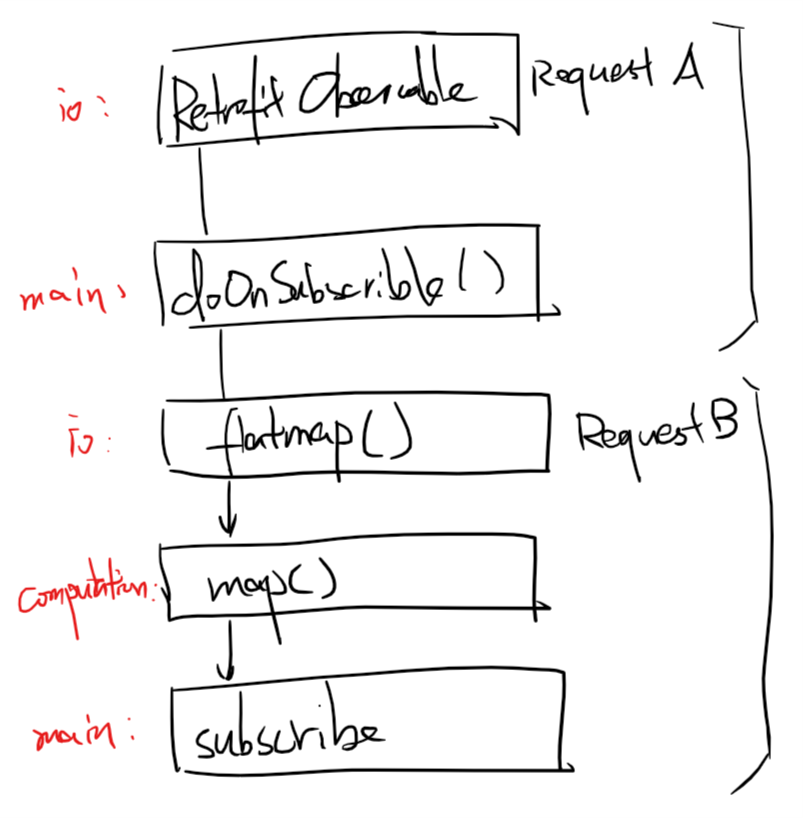

# RxJava 笔记

阅读内容： <http://gank.io/post/560e15be2dca930e00da1083>

## RxJava API 介绍和原理

### 概念：扩展的观察者模式

RxJava 是一个观察者模式的工具库。

RxJava 中的基本概念：

1. Observable - 被观察者
2. Observer - 观察者
3. subscribe - 订阅
4. 事件

RxJava 的事件回调，最基本的事件是`onNext()`，它相当于`onClick()`和`onEvent()`之类。

特殊的事件：表示事件队列完结的`onCompleted()`和表示事件队列异常的`onError()`，正确运行的事件队列中，他们有且仅有一个（不是各有一个），且是事件序列中的最后一个。

### 基本实现

    Code 1 - 创建 Observer（观察者）

<!-- -->

    Code 2 - 创建 Subscriber

`Subscriber`扩展了`Observer`，实际使用 subscribe 时，`Observer`会被转换成`Subscriber`。但`Subscriber`增加了

1. `onStart()`方法：可选，总在 subscribe 发生的线程被调用，如果需要特定线程可以用`doOnSubscribe()`；
2. `unsubscribe()`方法：取消订阅，不再接收事件。subscribe 之后，`Observable`会持有`Subscriber`的引用，不需要时应当尽快 unsubscribe 防止内存泄漏。

    Code 3 - 创建 Observable（被观察者）

`Observable.OnSubscribe` - 当 `Observable` 被订阅的时候将被调用的方法（这个对象的`call(...)`方法）。

    Code 4 - 订阅

订阅是使用 `observable.subscribe(subscriber)`，看起来是“给被观察者设置了一个订阅者”。

`subscribe()`大致上会执行这几个操作：

```java
    public Subscription subscribe(Subscriber subscriber) {
        subscriber.onStart();
        onSubscribe.call(subscriber);    // 这个 onSubscribe 是 observable 的
        return subscriber;
    }
```

    Code 5 - 使用回调方法创建 Subscriber

使用`observable.subscribe(Action1 onNext, Action1 onError, Action0 onCompleted)`方法，可以无需显示地创建 Subscriber，而让 Observable 根据相应的动作隐式地自行创建 Subscriber。

### 场景示例

    Code 6 - 依次打印字符串数组中的字符串

使用`Observable.from(T[] array)`。

`Observable.from()`可以从一个数组创建 Observable，依次发送它们。

    Code 7 - 从 ID 取得图片并显示出来

使用`Observable.create( new OnSubscribe<T> ).subscribe( new Observer<T> )`。

### 线程控制

    Code 8, Code 9 - 线程控制

不指定线程的时候，会在调用`subscribe()`的线程中生产事件和消费事件。

如果需要切换线程，需要使用`Scheduler`。RxJava 内置的 Scheduler：

* `Schedulers.immediate()`：在当前线程运行，相当于不指定线程（默认值）。
* `Schedulers.newThread()`：总是在新的线程中执行操作。
* `Schedulers.io()`：使用一个无上限的线程池进行操作，适用于读写文件/数据库和网络请求。
* `Schedulers.computation()`：使用一个根据 CPU 核心数调节容量的线程池操作，进行 CPU 密集型计算。
* `AndroidSchedulers.mainThread()`：在 Android 的主线程（UI线程）进行操作。

可以用`subscribeOn()`和`observeOn()`两个方法对线程进行控制。

* `subscribeOn()`：指定`subscribe()`发生的线程，也就是`Observable.OnSubscribe`被激活时所在的线程（事件产生的线程）。
* `observeOn()`：指定`Subscriber`所处的线程（事件消费的线程）。

`subscribeOn(Scheduler.io())`和`observeOn(AndroidSchedulers.mainThread())`的组合非常适用于从 **后台线程获取数据，在主线程显示数据** 的情景。

### 变换

RxJava 提供了 **将事件序列中的对象或者整个序列进行处理，转换成不同的事件或事件序列** 的特性，即变换。

#### map() 变换

    Code 10 - map() 变换

`map()`使用`Func1`作为参数，直接变换了事件对象。

#### flatMap() 变换

    Code 11 - flatMap() 变换



```java
    // Code 11 - flatMap() 变换
    List<Student> students = Student.makeList();
    Observable.from(students)  // <-- 这个是“原始 Observable”
            .flatMap(new Func1<Student, Observable<String>>() {  // <-- 这个 Func1 接收每个发送出来的 Student，...
                @Override
                public Observable<String> call(Student student) {
                    return Observable.from(student.courses);  // <-- ...并用它创建一个新的 Observable，同时激活它。
                                                              //     创建出来的 Observable 发送的事件都被汇总，然后
                                                              //     交到原始 Observable 的 Subscriber 那里去。

                    // return Observable.just("Hi,A", "Hi,B");  // 为了加强理解，可以不用原始的student，
                                                                // 随便创建一个Observable
                }
            })
            .subscribe(new Action1<String>() {
                @Override
                public void call(String o) {
                    Log.d(TAG, "Code 11 - onNext: " + o);
                }
            });
```

将会输出：

```
D/RxTest4Activity: Code 11 - onNext: Student's name 0 - course 0
D/RxTest4Activity: Code 11 - onNext: Student's name 0 - course 1
D/RxTest4Activity: Code 11 - onNext: Student's name 0 - course 2
D/RxTest4Activity: Code 11 - onNext: Student's name 0 - course 3
D/RxTest4Activity: Code 11 - onNext: Student's name 0 - course 4
D/RxTest4Activity: Code 11 - onNext: Student's name 1 - course 0
D/RxTest4Activity: Code 11 - onNext: Student's name 1 - course 1
D/RxTest4Activity: Code 11 - onNext: Student's name 1 - course 2
D/RxTest4Activity: Code 11 - onNext: Student's name 1 - course 3
D/RxTest4Activity: Code 11 - onNext: Student's name 1 - course 4
D/RxTest4Activity: Code 11 - onNext: Student's name 2 - course 0
D/RxTest4Activity: Code 11 - onNext: Student's name 2 - course 1
D/RxTest4Activity: Code 11 - onNext: Student's name 2 - course 2
D/RxTest4Activity: Code 11 - onNext: Student's name 2 - course 3
D/RxTest4Activity: Code 11 - onNext: Student's name 2 - course 4
D/RxTest4Activity: Code 11 - onNext: Student's name 3 - course 0
D/RxTest4Activity: Code 11 - onNext: Student's name 3 - course 1
D/RxTest4Activity: Code 11 - onNext: Student's name 3 - course 2
D/RxTest4Activity: Code 11 - onNext: Student's name 3 - course 3
D/RxTest4Activity: Code 11 - onNext: Student's name 3 - course 4
D/RxTest4Activity: Code 11 - onNext: Student's name 4 - course 0
D/RxTest4Activity: Code 11 - onNext: Student's name 4 - course 1
D/RxTest4Activity: Code 11 - onNext: Student's name 4 - course 2
D/RxTest4Activity: Code 11 - onNext: Student's name 4 - course 3
D/RxTest4Activity: Code 11 - onNext: Student's name 4 - course 4
```

`flatMap()`相当于用`Func1`将 **每个** 事件参数对象转换成了一个能发射另一些参数对象的 Observable，并集中汇总它们发射出来的对象。作为结果，每个原来的事件参数对象都被“展平”成了一系列另一种类型的参数对象，传递给原本的 Subscriber 那里。

#### throttleFirst() 变换

    Code 12 - throttleFirst() 变换

这个变换可以忽略 **每次成功触发事件后一定时间内的其他事件**，也就是类似事件去抖动的机制。

#### 变换的原理：lift()

简单来说，`lift()`使用了类似代理模式的方法，使用`Operator`创建一个新的`Observable`包裹原来的`Observable`，负责接收原来的`Observable`发出的事件，并在事件处理后发送给`Subscriber`。

另外，RxJava 并不建议开发者自定义`Operator`直接使用`lift()`，而是尽量使用已有包装方法的组合来完成需求。

#### 对 Observable 的变换：compose()

`compose()`针对`Observable`自身进行变换。

    Code 13 - compose() 变换

使用`compose()`可以组合一系列的`lift()`操作。

### 线程控制：Scheduler（二）

`observeOn()`指定的其实是 Observable 变换到“当前”状态的时候的 Subscriber 所在的线程。

    Code 14 - 多次切换线程



简单来说，`observeOn()`决定的是它之“下”的操作所在的线程；`subscribeOn()`决定的是它之“上”的操作所在的线程。

但 subscribe 操作由下而上，onNext 由上到下；在没有被其他调度打断的时候，**onNext 的开始**会延续 **subscribe 的结束**的线程调度状态。

**对于通知过程（onNext）来说**，只有最上面的那个`subscribeOn()`会生效，其后会依次受到各个`observeOn()`的影响。

**对于订阅过程（subscribe）来说**，`subscribeOn()`从下到上依次生效。

    Code 15 - 混合的 subscribeOn() 和 observeOn()



这样一来就可以在多种操作之间自由切换线程了。

### doOnSubscribe() 的线程

一个指定线程时存在的问题：Subscriber 的`onStart()`处在链式调用的底端，无法指定线程，只能执行于`subscribe()`被调用时所处的线程。

`Observable.doOnSubscribe()`和`Subscriber.onStart()`同样是在`subscribe()`调用后、事件发送前执行，但它可以指定线程。

默认情况下它会在和`subscribe()`发生的相同线程中执行；但如果`doOnSubscribe()`之后，也就是链式调用的 **下方** 存在`subscribeOn()`，它就会执行于这个`subscribeOn()`指定的线程。

    Code 16 - doOnSubscribe() 的线程



## RxJava 的适用场景

### 与 Retrofit 的结合

    Code 17 - RxJava + Retrofit 进行网络请求



这个示例模拟了“在网络请求发起时更新UI -> 处理请求结果 -> 根据请求结果再次更新UI”的过程。

使用了[JSONPlaceholder](https://jsonplaceholder.typicode.com) API。

* **在发起请求时更新UI** 在`subscribeOn()`中完成；
* **处理请求结果** 在`map()`中完成；
* **根据处理后的结果更新UI** 在`subscribe()`中完成。

期间根据需求调度线程。

    Code 18 - RxJava + Retrofit 按顺序依次发起两个请求



这个示例模拟了“更新 UI -> 发起请求 A -> 利用请求 A 的结果发起请求 B -> 处理请求 B 的结果 -> 根据请求 B 的结果再次更新 UI”的过程。

具体来说，它会发起一个 JSONPlaceholder 的`/posts`请求，用这个请求`返回字符串的长度 % 10 + 1`作为`id`，发起`/post/{id}`请求。

实际应用中类似的情景是，先发起一个请求获取 token，然后使用这个 token 发起其他请求。

RxJava 有一点好，就是在链式声明的任意位置抛出的异常都会被 Subscriber 的`onError()`接到，可以统一处理。